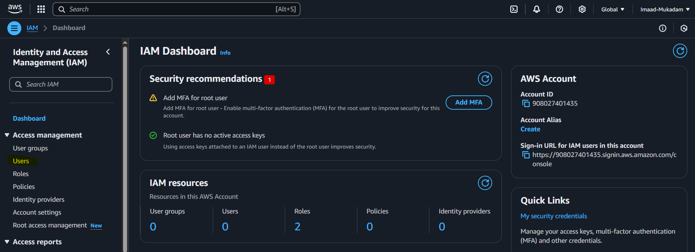

# AWS-Create-Group-and-user

## Summary

### **AWS IAM User Management**  

This project automates the creation and management of AWS IAM users and groups. It ensures secure access control by organizing users into groups and assigning appropriate permissions.  

#### **Features:**  
✅ Creates a new IAM user with programmatic and/or console access  
✅ Adds the user to a specified IAM group  
✅ Assigns **AdministratorAccess** permissions to the group  
✅ Uses AWS best practices for managing permissions  

This setup simplifies IAM management and ensures secure access control within AWS environments.  

## Step - 1 

i. Search for IAM (Manage Access to AWS resource) 

ii. Click on Users 

iii. Click on Create Users

iii. Provide your user name

iv. Click next after configuration

## Step - 2 

i. Now Lets create group, Click on create group

ii. Give your Group name , Then select which permission you want to provide to your group, then click on create group

iii. Select your group then click next

iv. Now Click on create user

v. Check IAM Dashboard you can see your user and group is created

## Step - 3

i. Lets Login to AWS using your created user, for this click on your created user then , go to Security Credentials & copy the Console Sign-in link , and paste it in incognito tab

ii. Now provide your username and password for sign-in

iii. You can see you are login with your created user

